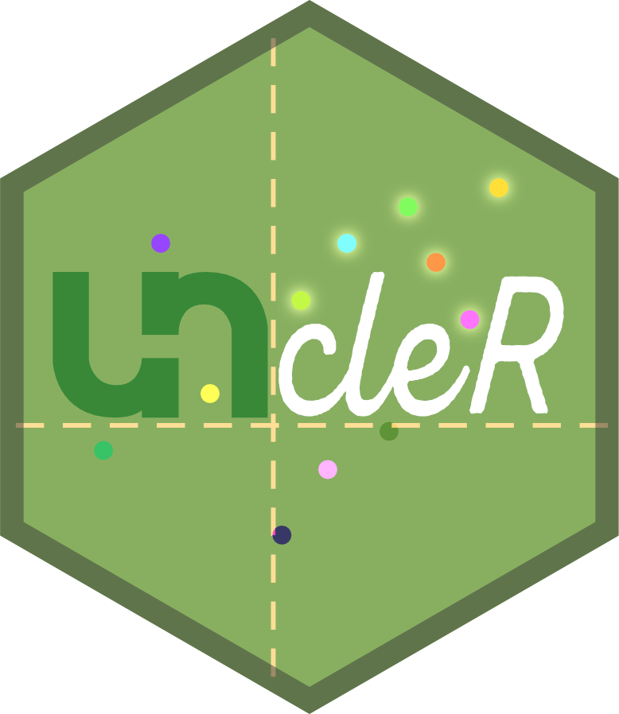

<!-- README.md is generated from README.Rmd. Please edit that file -->

```{r, include = FALSE}
knitr::opts_chunk$set(
  collapse = TRUE,
  comment = "#>",
  fig.path = "man/figures/README-",
  out.width = "100%"
)
```
# UNcleR 

<!-- badges: start -->
<!-- badges: end -->

## Overview

`UNcleR` is an R package for parsing data exported from an Unchained Labs *UNcle* instrument for downstream processing of biologics stability data.

The `consolidate_experiments` function utilizes the core functions listed below to import UNcle data exports into a succinct and readily accessible data structure based on the hierarchical structure of the directories in which the data is stored. Experimental data for a single run from nanoDSF, SLS, and DLS summary and spectra files are organized into a unified dataframe and nested within a named list returned by the function according to which experiment (i.e. plate or screen) they belong to.

Core functions for summary and "bundle export" files:

* `import_staticBundle` imports nanoDSF and SLS spectra bundle 
* `import_dynamicBundle` imports DLS spectra bundle files 
* `import_DLSsum()` imports DLS summary data
* `import_SLSsum()` imports nanoDSF and SLS thermal ramp summary data
* `get_meta` imports metadata from an Excel document into a list of dataframes
* `add_meta` assigns metadata to an imported and parsed dataframe

Legacy functions for "complete export" files:

* `import_DLSspec()` imports correlation, intensity, or mass distribution DLS spectra
* `import_SLSspec` imports SLS spectra at a specified wavelength
* `import_FLUORspec()` imports nanoDSF spectra

Questioning:

* `join_SLS_DLS` joins SLS and DLS data together before metadata assignment

## Installation
<!--
You can install the released version of UNcleR from [CRAN](https://CRAN.R-project.org) with:

``` r
install.packages("UNcleR")
```
-->
You can install the most stable version from [GitHub](https://github.com/) with:

``` r
if (!require(devtools)) install.packages("devtools")
devtools::install_github("eric-hunt/UNcleR@main")
```

..or the development version with:

``` r
if (!require(devtools)) install.packages("devtools")
devtools::install_github("eric-hunt/UNcleR@dev")
```

<!--
## Example

This is a basic example which shows you how to solve a common problem:

```{r example}
## library(UNcleR)
## basic example code
```
-->
